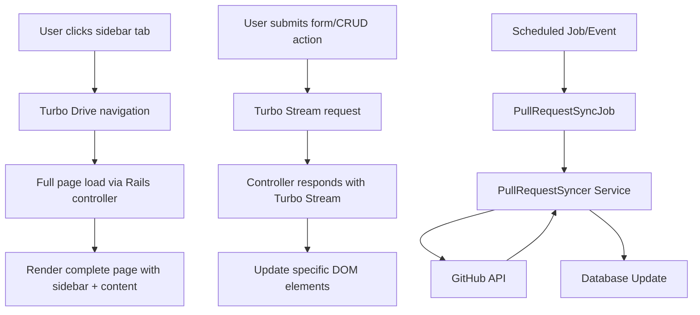

# System Patterns

## System Architecture

Rails 8.0 monolithic application with Hotwire frontend using consistent Turbo patterns and background job processing:

## Key Technical Decisions

1. **Turbo Drive for Navigation**: Main tab switching uses standard page loads
2. **Turbo Streams for Updates**: CRUD operations update page sections dynamically
3. **No Nested Frames**: Avoid complex frame-in-frame structures
4. **Authentication via Current.user**: Consistent user context across all requests

## Design Patterns in Use

- **MVC Architecture**: Standard Rails controller/view/model separation
- **RESTful Routes**: Standard REST patterns for resource management
- **Hotwire SPA Feel**: Fast navigation without JavaScript complexity
- **User-Scoped Data**: All resources belong to authenticated users

## Component Relationships

- **Controllers**: Handle authentication, set instance variables, respond to HTML/Turbo Stream
- **Views**: Render complete pages or stream updates to specific DOM IDs
- **Models**: Standard Rails models with user associations
- **Authentication**: Shared concern ensuring Current.user is available

## Critical Implementation Paths

1. **Authentication Flow**: Session management and Current.user setup
2. **Navigation**: Sidebar links triggering full page loads
3. **CRUD Operations**: Forms using Turbo Streams for dynamic updates
4. **DOM Targeting**: Consistent element IDs for Turbo Stream operations
